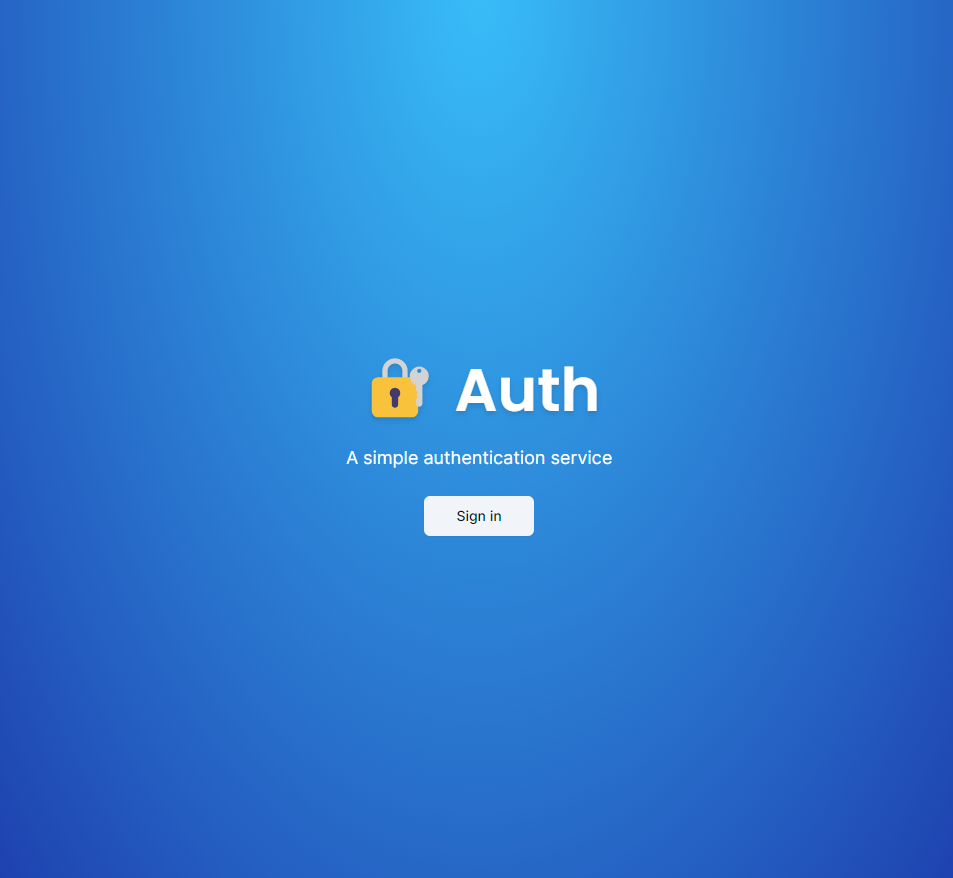
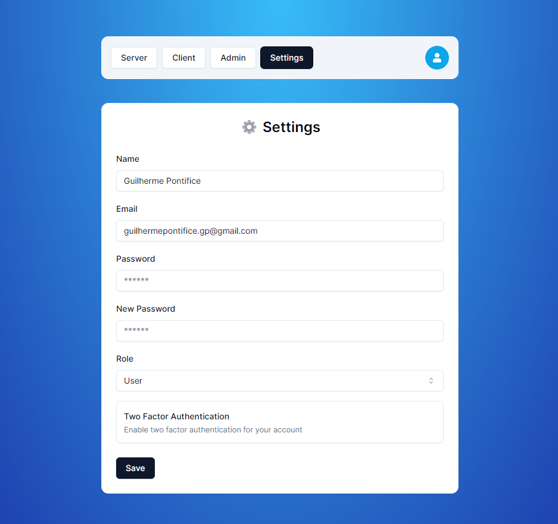
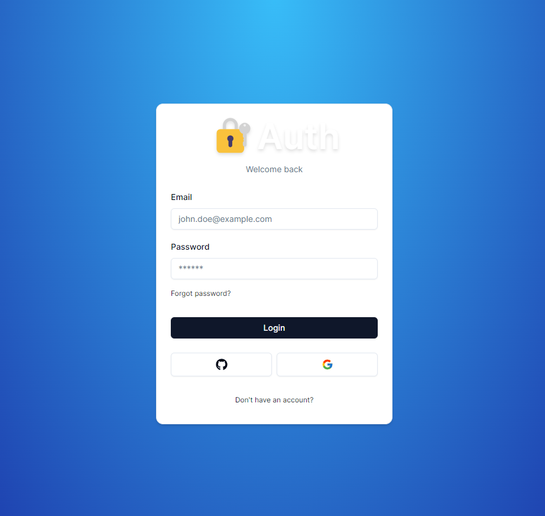

# Projeto de Autenticação


Esse é um projeto feito com [Next.js](https://nextjs.org/) inicializado com [`create-next-app`](https://github.com/vercel/next.js/tree/canary/packages/create-next-app).

<p align="center">

</p>

## Features

- Autenticação em dois fatores.
- Login com Github e Google
- Criação de conta
- Redefinição de senha

https://authentication-psmg017s8-guilhermes-projects-98390dcb.vercel.app/

<p align="center">

</p>

<p align="center">

</p>


## Começando

Primeiro, para rodar localmente no server digite:

```bash
npm run dev
# ou
yarn dev
# ou
pnpm dev
# ou
bun dev
```

Abra [http://localhost:3000](http://localhost:3000) com o navegador para ver o resultado.

Você pode começar a editar a página modificando  `app/page.tsx`. A página carrega automaticamente conforme o arquivo é editado.

No projeto, é usado [`next/font`](https://nextjs.org/docs/basic-features/font-optimization) para carregar automaticamente e carregar Inter, uma fonte do google customizada.

## Saiba mais

Para saber mais sobre Next.js, acesse os links abaixo:

- [Documentação do Next.js](https://nextjs.org/docs) - Saiba mais sobre a API e Recursos do Next.js.
- [Acesse Next.js](https://nextjs.org/learn) - um tutorial interativo de Next.js.

Você pode acessar [the Next.js GitHub repository](https://github.com/vercel/next.js/) - as suas contribuições são bem-vindas!
